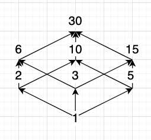

Based on

1. [Milewski, B. (2019). Category theory for programmers. Blurb.](https://bartoszmilewski.com/2014/10/28/category-theory-for-programmers-the-preface/)
2. [Milewski B. Course on Category Theory I, YouTube](https://www.youtube.com/playlist?list=PLbgaMIhjbmEnaH_LTkxLI7FMa2HsnawM_)
3. Cheng, E. (2023). The joy of abstraction: An exploration of math, category theory, and life. Cambridge University
   Press.
4. Murawski, R., & Świrydowicz, K. (2006). Podstawy logiki i teorii mnogości. Poznań: Wydawnictwo Naukowe UAM

---

- [Formal Logic](#formal-logic)
- [Set Theory](#set-theory)
- [Relation Theory](#relation-theory)
- [Ordered structures](#ordered-structures)
    * [Binary Relation](#binary-relation)
    * [Totally ordered sets (Tosets)](#totally-ordered-sets-tosets)
        + [Trichotomy](#trichotomy)
    * [Partially ordered sets (Posets)](#partially-ordered-sets-posets)
- [Category Theory](#category-theory)
    * [Relationship](#relationship)
    * [Directionality](#directionality)
    * [Correspondence](#correspondence)
    * [Composition](#composition)

# Formal Logic

# Set Theory

# Relation Theory

# Ordered structures
To define ordered structure we need a definition of binary relation. Binary relation involves two arguments (`a,b`) and
*relation* (`R`,`~`) as variable: (`aRb`, `a~b`)

- **Reflexity**: involves one object.
    - **Definition:** A relation R on a set S is called reflexive if `∀a ∈ S, aRa`
        - **Example 1:** Let `S = ℝ` and let `R` be the relation `=`.
            - Now, given `a ∈ ℝ` certainly `a = a` so `R` is **indeed reflexive**.
        - **Example 2:** Let `S = ℝ` and let `R` be the relation `<`.
            - Now, given `a ∈ ℝ` certainly `a < a` so `R` is **not reflexive**.
- **Symmetry**: involves two objects.
    - **Definition:** A relation R on a set S is called symmetric if `∀a,b ∈ S, if aRb then bRa`
        - **Example 1:** Let `S = ℝ` and let `R` be the relation `=`.
            - Now, let `a,b ∈ ℝ`. If `a = b` then it is also true that `b = a`, so this relation is **symmetric.**
        - **Example 2:** Let `S = ℝ` and let `R` be the relation `<`.
            - Now, let `a,b ∈ ℝ`. If `a < b` then it is definitely not true `b < a`, so this relation is **not
              symmetric.**
        - **Example 3:** Let `S = ℤ` and let `R` be the relation `|`.
            - Now, let `a,b ∈ ℤ`. If `a | b` then it is possible that `b | a`: `2 | 2` but it is not necessarily true
                - `2 | 4` but not `4 ∤ 2` so the relation is **not symmetric.**
    - **Antisymmetry**
        - **Definition:** A relation R on a set S is called antisymmetric if `∀a,b ∈ S, if aRb never bRa`
            - **Example 1:** Let `S = ℝ` and let `R` be the relation `<`.
                - Now, let `a,b ∈ ℝ`. If `a < b` then it is definitely never `b < a`
- **Transitivity**: involves three or more objects.
    - **Definition:** A relation R on a set S is called transitive if `∀a,b,c ∈ S: {aRb & bRc} => aRc`
        - **Example 1:** Let `S = ℝ` and let `R` be the relation `=`.
            - Now, let `a,b,c ∈ ℝ`. If `a = b` and `b = c`  then it follows that `a = c`, so this relation is *
              *transitive.**
        - **Example 2:** Let `S = ℝ` and let `R` be the relation `<`.
            - Now, let `a,b,c ∈ ℝ`. If `a < b` and `b < c` then it follows that `a < c`, so this relation is *
              *transitive.**
        - **Example 3:** if `a` is the mother of `b` and `b` is the mother of `c`
            - then `a` is definitely not the mother of `c`, so the relation `is the mother of` is **not transitive**.
        - **Example 4:** if `a` is the sister of `b` and `b` is the sister of `c`
            - then it is possible that `a` is the sister of `c` but it is not necessarily true
                - `a = person1`, `b = person2`, `c = person1` so the relation is **not transitive**
- **Equivalence Relation**
    - **Definition:** If a relation R on a set S is reflexive, symmetric and transitive then we call it an *equivalence
      relation*.
        - **Example 1:** Let `S = ℤ` and let `R` be the relation `≤`. Now, given `a,b,c ∈ ℤ`:
            - Certainly `a ≤ a` so `R` is reflexive.
            - But it is not symmetric: `a ≤ b` and `b ≤ a` could be true only if `a = b`.
            - If `a ≤ b` and `b ≤ c` then it follows that `a ≤ c`, so this relation is transitive.
                - So the relation is **not equivalence relation**
        - **Example 2:** ...

## Totally ordered sets (Tosets)

- **Definition:** A totally ordered set is a category in which for all objects `a`, `b` there is exactly one arrow
  between them.
- **(T, ≤)**: reflexive, antisymmetric, transitive, **comparable**
    - **Example:** Let `S = ℕ` and let `R` be the relation `≤`. Now given `a,b ∈ ℕ`:
        - Definitely `a ≤ b` or `b ≤ a` is true, and they can't both be unless `a = b`.
            - Therefore `ℕ` is totally ordered set.
- **Non-categorical definition of ordered set**
    - reflexivity: `a ≤ a, ∀a ∈ S`
    - antisymmetry: `((a ≤ b) and (b ≤ a)) => (a = b)`
    - transitivity: `((a ≤ b) and (b ≤ c)) => (a ≤ c)`
    - **trichotomy**: `∀a, ∀b ∈ S, a ≤ b or b ≤ a`

Ways how a category of totally ordered sets could fail:

- a pair of objects with *more* than one arrow between them or,
- a pair of objects with *fever* then one arrow between them (i.e. none)

### Trichotomy

In math we typically use the "inclusive or" which really means "and/or". So `a ≤ b or b ≤ a` means `a ≤ b or b ≤ a
or both`. If we mean one of them but not both, that's called "exclusive or". There are various reasons for
preferring the inclusive or, but one is that it comes up more often and so it's more **efficient** to take it as the
default.

The reflexivity condition for totally ordered set definition is redundant: **reflexitivity is a special case of
trichotomy**:

- if we put `a = b` in the definition of trichotomy, we get `a ≤ b or b ≤ a`, wchich is reflexivity
    - If we say "X is true or X is true" then it's logically equivalent to saying "X is true".

In the categorical definition we don't need the other conditions because:

1. Reflexivity comes from the category having indetities.
2. Transitivity comes from composition in the category.
3. Antisymmetry and trichotomy both come from there being exactly one arrow between `a` and `b`
    - antisymmetry comes from there being *at most one* - `∃!`
    - trichotomy from there being *at least one* - `∃`

## Partially ordered sets (Posets)

- **Definition:** A partially ordered set is a category in which for any objects `a`, `b` there is at most one arrow
  between them.
- **(P, ≤), reflexive, antisymmetric, transitive**
    - Therefore `a -> b` is `true/false` statement: `true` - arrow or `false` - no arrow.
        - **Example:** Let `S = <1, 30>` and let `R` be the relation `|`. Now given  `a = 30, b ∈ <1, 30>`:
            - `P = {1,2,3,5,6,10,15,30}`
                - `1` because `1|30`
                    - ->`2` -------> `30`
                        - ->`6` ->
                        - ->`10`->
                    - ->`3` -------> `30`
                        - ->`6` ->
                        - ->`15`->
                    - ->`5` -------> `30`
                        - ->`10`->
                        - ->`15`->

# Category Theory

- *Pedantry* is precision that does not increase clarity.
- A *diagram* in a category is a collection of objects and arrows from the category, possibly not all of them.
  A diagram is said to *commute* if any two composable strings with the same endpoints produce the same pomposite.

  <table>
    <thead>
      <tr>
        <th></th>
        <th>Equivalence Relation</th>
        <th>Category</th>
        <th>Group</th>
        <th></th>
      </tr>
    </thead>
    <tbody>
      <tr>
        <td></td>
        <td>objects relations</td>
        <td>objects arrows</td>
        <td> objects</td>
        <td></td>
      </tr>
      <tr>
        <td><b>PROPERTIES</b></td>
        <td>reflexivity symmetry transitivity</td>
        <td>identities inverses composition</td>
        <td>identity inverses binary operation</td>
        <td><b>STRUCTURE</b></td>
      </tr>
      <tr>
        <td></td>
        <td></td>
        <td>unitality associativity</td>
        <td>unitality associativity</td>
        <td></td>
      </tr>
    </tbody>
  </table>

- Category
    - Objects
        - e.g.: `A`, `B`, `C`
    - Morphisms/Arrows
        - e.g.; `A->B`, `B->C`
- Abstraction
    - Composition
        - ∀(`f: A->B` & `g: B->C`) ∃(`g∘f : A->C`)
            - g after f order because: `g(f(x))`
        - Associativity
            - `h ∘ (g ∘ f) = (h ∘ g) ∘ f`
        - 
    - Identity
        - ∀x ∈ Ob(C), ∃ idX : X → X
            - C: category
            - Ob: objects
        - left & right identity
            - idb ∘ f = f
            - g ∘ ida = g
        - 

## Relationship

- Mapping objects in sets with arrow we have ordered pairs
    - `(a, b) != (b, a)`
- Without an arrow we have unordered pair
    - `{b,a} = {a,b}`
- **Directionality** comes from function axioms.
- **Order** comes from set axioms
- Image is a subset of the codomain, not necessarily all of it.
    - `f: X->Y, f(X) = {f(x) | x ∈ X}`
        - e.g.: `X = {1,2,3}, Y = {a,b,c,d}, Im(f) = {a,c}`

## Directionality

Is the function invertible? Usually it is not.

- Function `f :: a->b` is invertible if there's
- another function `g :: b->a`.
    - g ∘ f = ida
    - f ∘ g = idb
- If it's defined only in composition and identity terms it's categorical terms
- A function that's invertible is automatically **symetric**
- A function that's invertible is called **isomorphism**

Why most function and not invertible?

1. Let's take function `bool isEven(int x)`. It collapses x1, x2, ... to two values:
   true or false. You can make an inversion, however you have multiple values called **fiber**.

- 

2. If a function maps to an image of codomain, you can't really invert codomain. You can only make an inversion of the
   image.

- 

## Correspondence

- Point (1) from [directionality] corresponds to **abstracting**
    - > You can boil an egg, but you can't unboil the egg.
    - > I really don't care of which points I came from (x fiber). I'm only interested in one property there (y)
        - > From wherever we came from, it's over and done.
    - If function **does not collapse** things, then it's called **injective function (injection)**:
        - x1 ->fx1
        - x2 ->fx2
- Point (2) from [directionality] corresponds to **modeling**
    - One set to the other set. I see one figure in a category in different category.
    - A man could cast a shadow in a cave (like in Plato's cave)
    - if the function cover the whole codomain (image is equal to codomain) is called **subjective function**
        - ∀y ∃x,y = fx

If a function is **injective** and **subjective**, it's actually **isomorphism**, you can invert it.

How to talk about **injections** and **subjections** as can't talk about elements in Category Theory - these are
abstracted.

I have to explain these things only in terms of morphisms.
> No matter how good you microscope is, you cannot look inside a little point.

> If my microscope doesn't work maybe my telescope could work.

> In Category Theory we don't like latin. We use greek.

- Surjective (onto) -> **Epic**, **Epimorphism**
- Injective -> **Monic**, **Monomorphism**

## Composition
