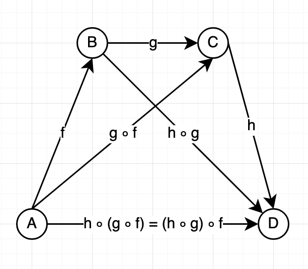

- Category
  - Objects
    - e.g.: `A`, `B`, `C`
  - Morphisms
    - e.g.; `A->B`, `B->C`
- Abstraction
  - Composition
      - ∀(`f: A->B` & `g: B->C`) ∃(`g∘f : A->C`)
        - g after f order because: `g(f(x))`
      - Associativity
        - 
  - Identity
    - ∀x ∈ Ob(C), ∃ idX : X → X
      - C: category
      - Ob: objects
